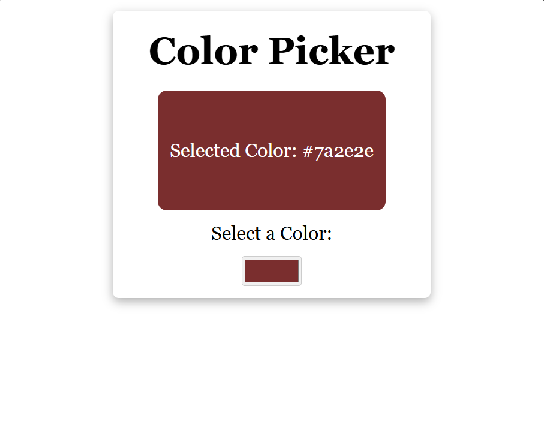
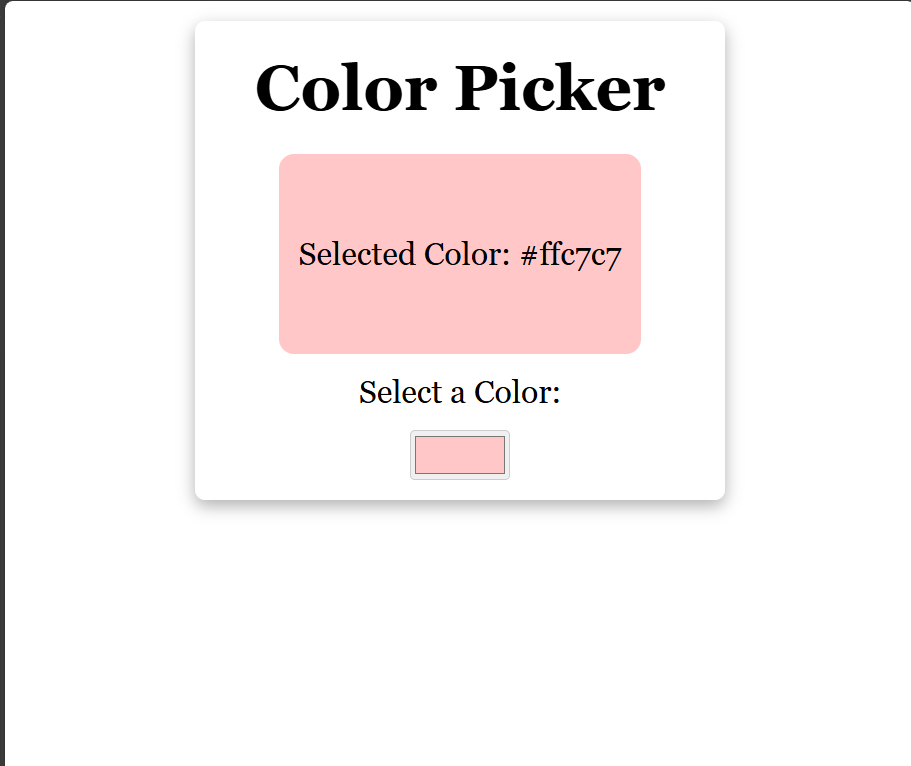

# React Components Collection

This repository contains reusable and customizable React components.  
Each component can be easily copied and used in any React project.

---

## 🛠 How to Run These Components

1. **Install Node.js (LTS version)**  
   Download and install from: [https://nodejs.org](https://nodejs.org)

2. **Create a new React project**  
   Open terminal and run:
   ```bash
   cd my-react-project
   npm install
   npm run dev

## 🔍 Component Previews

### 🎨 Color Picker




